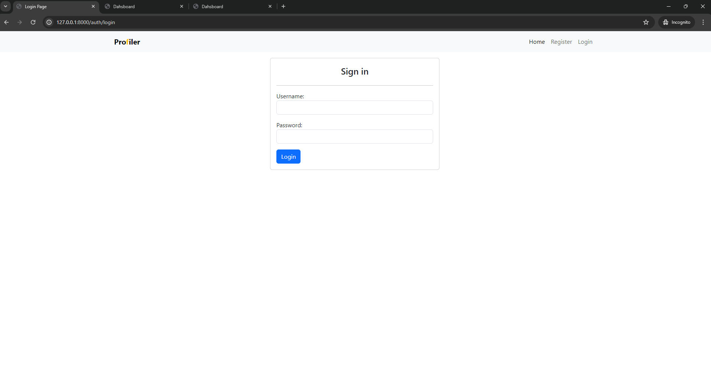

# Django-React Profile Application

This application combines Django backend with React frontend seamlessly integrated. React is embedded within Django without the need to run them separately, making it easy to handle both parts with Django templates.

## Features

- Development and production-ready versions available.
- Uses Django template for rendering.
- Utilizes React Context API for CRUD operations and alerts.
- Implements React Router for dashboard management.
- Django backend managed with Django Rest Framework (DRF).
- Handles authentication by obtaining CSRF tokens from cookies.

## Installation

1. Install Python dependencies:
   
   ```pip install -r requirements.txt```

2. Install Node.js dependencies:

```cd frontend```
```npm install```

3. For development, run:

```npm run dev```

4. For production, build the project with:

```npm run build```


## Screenshots

### Home Page


### Register


### Register Error


### Login


### Login Error


### Dashboard Without Profile


### Create Profile


### Create Profile Error


### Profile Created


### Edit Profile


### Profile Updated


### Delete Profile Modal


### Profile Deleted

